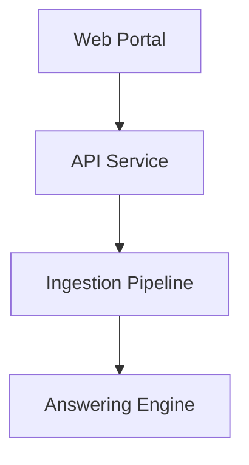

# 📚 quantico-ai-agency Documentation

Welcome to the complete documentation for this repository. This documentation is automatically generated and maintained by Woden Docbot.

   

## 🔗 Quick Links

[📂 tests](./tests/README.md)
[📋 Dependencies](./DEPENDENCIES.md)

---

> A document ingestion and question-answering platform that turns unstructured content into a searchable, chat-like knowledge assistant for teams and customers.

## 📖 Overview

DocBot ingests documents from multiple sources, extracts structured knowledge, and exposes an API and web portal for conversational and search-driven access. It empowers teams to query policies, manuals, and support documentation using natural language, reducing time-to-answer and surfacing relevant context snippets and citations.

The system uses a modular pipeline: ingestion transforms and stores content, embeddings and vector search enable semantic retrieval, and a generative answer engine composes responses with cited sources. It is designed for extensibility so new connectors, ML models, or storage backends can be added without changing the core user experience.

### 🧩 Key Components

| Component | Purpose | Technologies |
| --- | --- | --- |
| **Web Portal** | User-facing application for searching documents, asking questions, viewing sources, and managing content and users. | `React`, `TypeScript`, `Tailwind CSS` |
| **API Service** | REST/GraphQL API that handles user requests, session management, authentication, and coordinates retrieval and generation workflows. | `FastAPI`, `Python`, `OAuth2` |
| **Ingestion Pipeline** | Connectors and processors that fetch documents from storage (S3/Blob), perform OCR/text extraction, metadata tagging, and create embeddings. | `Apache Airflow`, `Python`, `Tika` |
| **Answering Engine** | Combines semantic search results with a language model to generate context-aware, cited answers and follow-up suggestions. | `OpenAI (or compatible LLM)`, `LangChain`, `Faiss` |

**Component Architecture:**

### 🏗️ Architecture

DocBot is a modular, microservice-style system: ingestion workers persist processed content, an embeddings store plus vector search support retrieval, and stateless API/answering services call LLMs to produce responses. Components communicate over authenticated APIs and scale independently.

### 💡 Use Cases

- ✦ Internal knowledge base search for customer support agents
- ✦ Self-service documentation assistant for end users
- ✦ Compliance discovery and evidence retrieval across policy documents

### 🔧 Technologies

**Languages:** 

**Frameworks:**  

**Databases:**  
   

### 📦 External Dependencies

The following external packages are used across the project:

- `aiohttp`
- `faiss-cpu`
- `langchain`
- `openai`
- `psycopg2-binary`
- `tika-python`
- `uvicorn`

---

## 📑 Documentation Sections

### [tests](./tests/README.md)
Contains unit tests that validate data-fetching scripts (Census ACS and FEC fetchers) to ensure correctness of those data ingestion components.

This directory contains unit tests focused on validating data fetchers used elsewhere in the repository.

---

## 📊 Documentation Statistics

- **Files Documented**: 2
- **Directories**: 2
- **Coverage**: 100%
- **Last Updated**: 2026-07-09

---

## 🧭 How to Navigate

> ℹ️ **INFO**
> Each directory has its own README.md with detailed information about that section. Use the breadcrumb navigation at the top of each page to navigate back to parent directories.

### Navigation Features

- **Breadcrumbs** - At the top of each page, showing your current location
- **Directory READMEs** - Each folder has a comprehensive overview
- **File Documentation** - Click through to individual file documentation
- **Search** - Use GitHub's search or your IDE's search functionality

---

## 🤖 About Woden DocBot

This documentation is automatically generated and kept up-to-date by Woden DocBot, an AI-powered documentation assistant. DocBot analyzes code on every pull request and updates documentation to reflect changes.

### Features

- **Automatic Updates** - Documentation updates on every PR
- **Comprehensive Coverage** - Files, functions, classes, and directories
- **Smart Navigation** - Breadcrumbs, related files, and parent links
- **AI-Powered** - Uses Azure GPT models for intelligent documentation generation

---

*Generated by Woden DocBot for quantico-ai-agency*